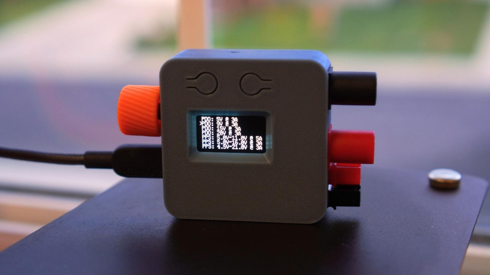
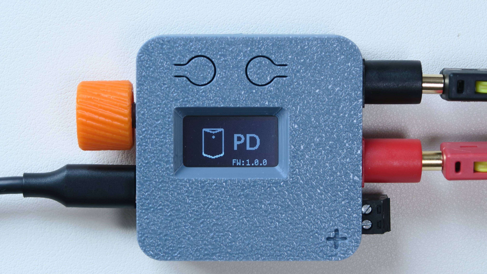
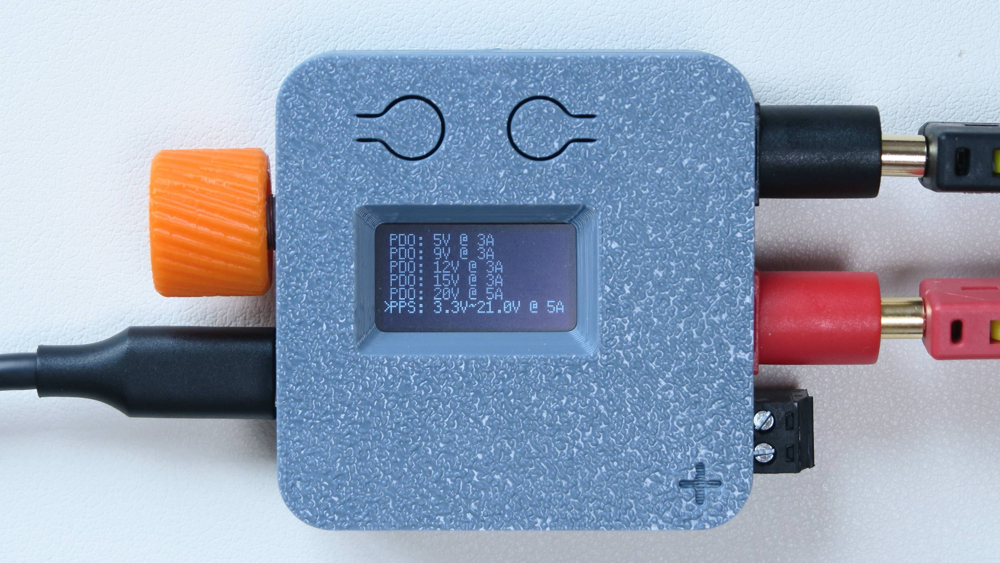
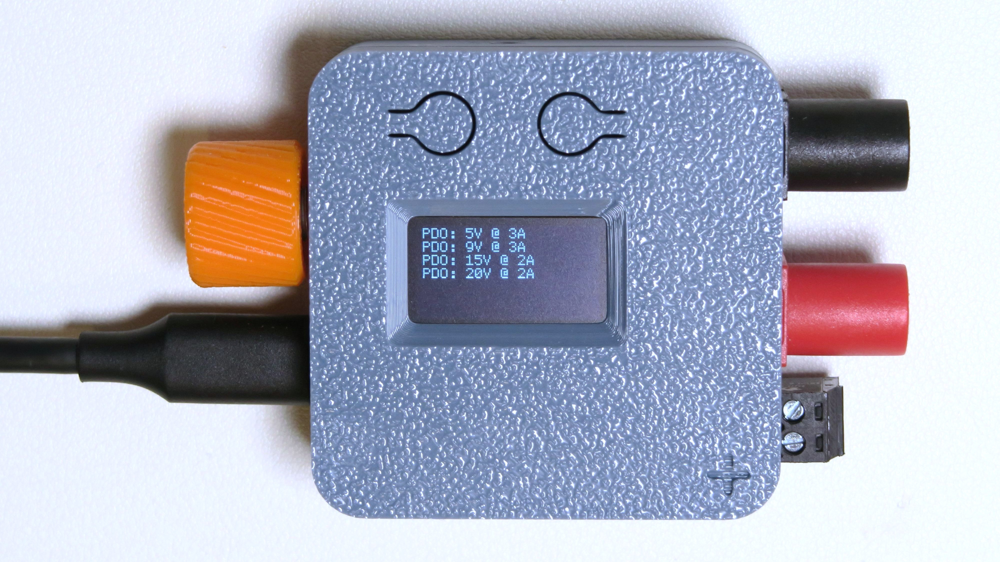
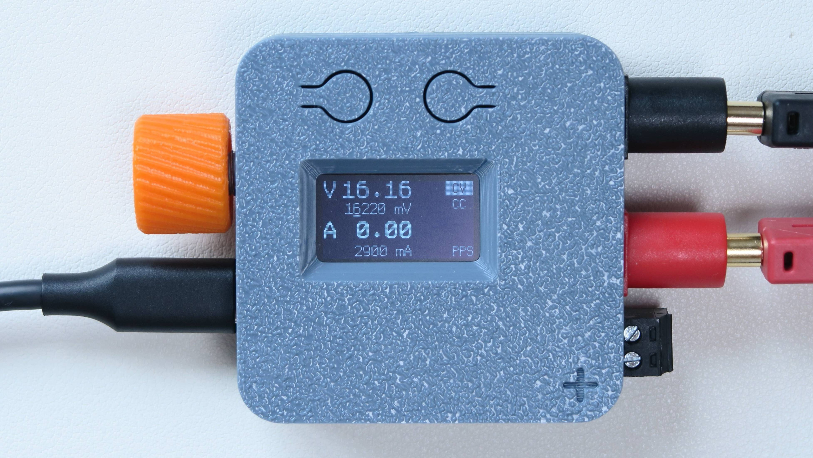
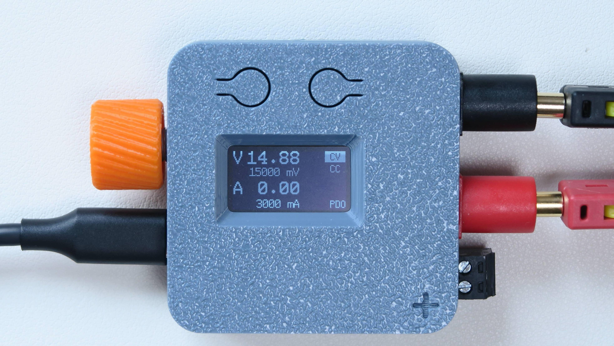
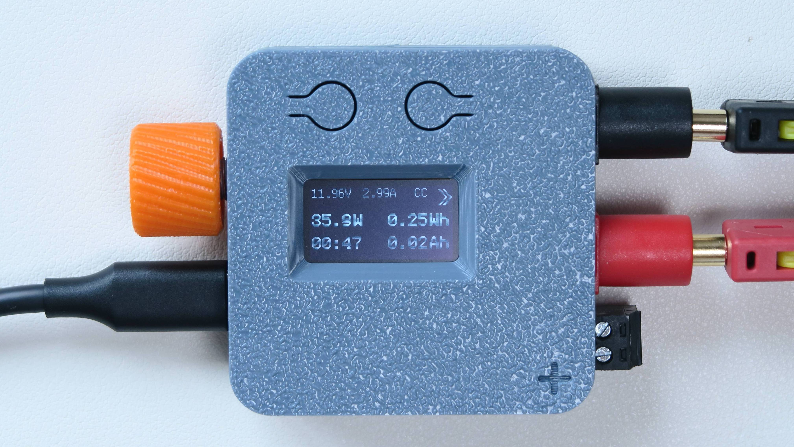
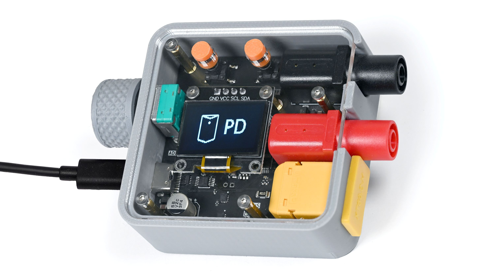

# PocketPD

[](https://github.com/CentyLab/PocketPD/actions/workflows/main.yml)


[](https://github.com/CentyLab/PocketPD/releases)


<p align="center" width="100%">
    
</p>

PocketPD turns any PPS-capable USB-C charger into a pocket-sized bench supply. Dial in a voltage and current with the knob, switch the output on, and watch live volts, amps, watts, and energy on the OLED. The whole thing runs from one knob and two buttons.


## Links
* [PocketPD Project - Hackaday](https://hackaday.io/project/194295-pocketpd-usb-c-portable-bench-power-supply)
* [PocketPD Hardware - GitHub](https://github.com/CentyLab/PocketPD_HW)

## Contents

- [What's new](#whats-new)
- [Feature](#feature)
- [Quick start](#quick-start)
- [Controls](#controls)
- [Operating manual](#operating-manual)
- [Under the hood](#under-the-hood)
- [Firmware compatibility](#firmware-compatibility)
- [Build from source](#build-from-source)
- [Flash new firmware](#flash-new-firmware)
- [Links](#links)


## What's new

For the full history, see the [release notes](https://github.com/CentyLab/PocketPD/releases).

## Feature

PocketPD detects and display a full PDO (Fixed and PPS) PD profiles. When using with PPS-capable chargers, PocketPD provides adjustable voltage and current controls.


- ✅ **PPS Control** — Set voltage in 20 mV steps and current in 50 mA steps. Push the knob to cycle the step size between coarse, medium, and fine.
- ✅ **Non-PD Source Passthrough** — PocketPD also works with non-PD source to provide live monitoring.
- ✅ **Live Readings.** — Voltage, current, and power
- ✅ **Energy Screen** — Running watt-hours, amp-hours, power, and time.
- ✅ **Cable Compensation** — Holds your set voltage at the load instead of the terminals by raising the PPS request to cancel the drop across the cable.
- ✅ **Input Locking** — Freeze the controls by holding both L and R button.

## Quick start

1. Plug a USB-C charger into PocketPD.
2. When the profile picker appears, rotate the knob to the PD profile you would like to use, then push-and-hold the knob to commit. Pick a `PPS` profile for an adjustable V and A.
3. If PPS profile is selected, in operating screen, tap the L (left) button to switch between voltage or current adjustment, push the knob to set the step size, then rotate to set the desired value.
4. Tap the right button to toggle the output on/off.
5. Hold the right button any time to see watt-hours, amp-hours, and elapsed time.

## Controls

PocketPD features 3 control buttons: **rotary encoder (knob)**, **left button (L)**, and **right button (R)**. Both short-press and long-press are supported. They are context-aware and what they all do depends on where you are in the PocketPD. We encourage users to playaround as we keep adding more features.

On the operating screen:

| Control | Action | What it does |
| --- | --- | --- |
| Knob | Rotate | Adjust the value you're editing (PPS only) |
| Knob | Tap | Cycle the step size, coarse to fine (PPS only) |
| L | Tap | Switch between editing volts and amps (PPS only) |
| L  | Hold | Open the menu |
| R | Tap | Turn the output on or off |
| R | Hold | Open the energy screen |
| L + R | Hold | Lock or unlock the screen |

Inside the menu, profile picker, and settings, the knob drives navigation: rotate to move the cursor, push to choose, and hold L button to go back.

## Operating manual

### Boot and profile pick

During boot, PocketPD shows its splash screen with the firmware version while it negotiates with the charger.

<p align="center" width="100%">
    
</p>

Once negotiation finishes, the profile picker lists all the published PDO profiles from the charger. Fixed profiles for example will show `PDO 5V 3A`, and PPS profiles show their adjustable range, like `PPS 3.3~21.0V 5A`.

<p align="center" width="100%">
    
</p>

Rotate the knob to highlight a profile, then push and hold to commit. PocketPD will navigate into the operating screen. Note that charger with no PPS profile still works but adjust power supply feature will be missing.

<p align="center" width="100%">
    
</p>

### Operating screen

__PPS__

The big numbers are the live measurements. On a PPS profile, the target voltage and current are located under each reading, with a small underscore cursor marking whether voltage or current is being adjusted.

<p align="center" width="100%">
    
</p>

Tap the right button to switch the output on and off. On a PPS profile, tap the left button to move between volts and amps, push the knob to cycle the step size (volts: 1 V / 100 mV / 20 mV, amps: 1 A / 100 mA / 50 mA), then rotate to set the value.

__Fixed__

Fixed and passthrough profiles have nothing to adjust, so the knob and the left button's tap do nothing there. A fixed profile only shows its rated voltage and current.

<p align="center" width="100%">
    
</p>


### Energy screen

Hold the R button to open the energy screen. It shows power, live voltage and current, the elapsed time, and the watt-hours and amp-hours. Hold the R button it again to go back. The energy counter accumulates only while the output is on.


<p align="center" width="100%">
    
</p>


### Menu and settings

Hold the left button to open the menu.

- **Skip picker:** When true, PocketPD boots straight to the operating screen using the first profile 5V as default instead of stopping at the picker.
- **Voltage comp:** When true, PocketPD watches the load-side voltage and raises the PPS request in 20 mV steps, up to 500 mV, to cancel the drop across the cable and connectors. It runs only while the output is on and a PPS profile is active, and it resets whenever the output is off or you change profiles.

### Non-PD sources

Plug in a charger with no USB-PD profiles and PocketPD shows `Non-PD Source`, then activates Passthrough Mode on its own after a few seconds. It meters the voltage and current flowing through to your load.

## Firmware under the hood

v2 is a rewrite of the original monolithic firmware. It runs on `tempo`, a small cooperative scheduler and typed event bus built for this project (it lives in `lib/tempo/` with its own native tests).

The UI is a stack of stages, one per screen: boot, PD negotiation, profile picker, operating, energy, menu, and settings. Periodic tasks run alongside the stages and talk to them over the event bus.

Hardware sits behind interfaces, one each for the PD sink, the power monitor, the display, the output switch, and the supply-voltage source. That split lets the AP33772 and INA226 drivers and the stage logic build and run as unit tests on a host machine:

```
pio test -e native
```

## Firmware compatibility

| Firmware Version | Hardware 1.0 <br> (Limited) | Hardware 1.1 | Hardware 1.2 | Hardware 1.3 <br> (CrowdSupply) |
| ------------------ | ------------------------ | -------------- | -------------- | ---------------------------- |
| `Release 2.0.1`  | x                      | x            | x            | x                          |

The main difference between HW1.0 and later boards is the sense resistor, which got updated from 10 mOhm to 5 mOhm and changes the current reading scale.

HW1.0 and HW1.1 also lack the V_SENSE voltage divider, so on those boards the firmware reads source-side voltage from the AP33772 instead of a dedicated ADC channel. The v2 build picks the right source automatically per board.

This is what the "Limited" HW1.0 looks like. While it looks cool, we had to move away from this design because of diffculty during mass production.

<p align="center" width="100%">
    
</p>

## Build from source

- Install [PlatformIO CLI](https://docs.platformio.org/en/latest/core/installation/index.html)
- Before PlatformIO pulls the pico-sdk, Windows users should follow [Important steps for Windows users, before installing](https://arduino-pico.readthedocs.io/en/latest/platformio.html#important-steps-for-windows-users-before-installing).
- Next, run `make build-all` to build `.uf2` files for all supported HW versions
- The firmware will be located in `dist` folder

## Flash new firmware

### Step 1: Grab the `.uf2`

Download firmware for your board from [PocketPD's releases](https://github.com/CentyLab/PocketPD/releases). For HW1.3, use `PocketPD_HW1_3-v2.0.1.uf2`.

### Step 2: Mount PocketPD as a drive on your computer.

For macOS users:

- Method 1 (easy):
  - Short the BOOT pads on the back with tweezers on `HW1.0`, or hold the BOOT button on `HW1.1+`.
  - Use a USB-A → USB-C adapter and cable to connect PocketPD to the computer. It should pop up as the `RPI-RP2` drive.
- Method 2 (intermediate):
  - Connect PocketPD over USB. No drive appears.
  - Open any serial monitor at 1200 baud. PocketPD should pop up as the `RPI-RP2` drive.

For Windows users:

- Method 1 (easy):
  - Short the BOOT pads on the back with tweezers on `HW1.0`, or hold the BOOT button on `HW1.1+`.
  - Connect PocketPD over USB. It should pop up as the `RPI-RP2` drive.
- Method 2 (intermediate):
  - Connect PocketPD over USB. No drive appears.
  - Open [Putty](https://www.putty.org/) on the serial port at 1200 baud. PocketPD should pop up as the `RPI-RP2` drive.

For Linux users:

- Method 1 (easy):
  - Short the BOOT pads on the back with tweezers on `HW1.0`, or hold the BOOT button on `HW1.1+`.
  - Connect PocketPD over USB. It enumerates as a USB mass storage device labelled `RPI-RP2`. Most desktops auto-mount it. If yours doesn't, find it (e.g. `lsblk`) and mount it manually: `sudo mount /dev/sdX1 /mnt`.
- Method 2 (intermediate):
  - Connect PocketPD over USB. No drive appears.
  - Open the serial port at 1200 baud (e.g. `picocom -b 1200 /dev/ttyACM0` then exit, or `stty -F /dev/ttyACM0 1200`). PocketPD re-enumerates as the `RPI-RP2` drive. The port closes right after the baud change, so some tools report an error, which is expected.

### Step 3: Flash `.uf2` file onto the drive

The device reboots into the new firmware on its own. Detailed guide: [How to upload new firmware to PocketPD](https://github.com/CentyLab/PocketPD/wiki/How-to-upload-new-firmware-to-PocketPD).

## Links

- [PocketPD Project on Hackaday](https://hackaday.io/project/194295-pocketpd-usb-c-portable-bench-power-supply)
- [PocketPD Hardware on GitHub](https://github.com/CentyLab/PocketPD_HW)

## Acknowledgement

Thanks to the many users who sent feature requests and test feedback over the years, and to our firmware contributors for making this project better with every commit.
