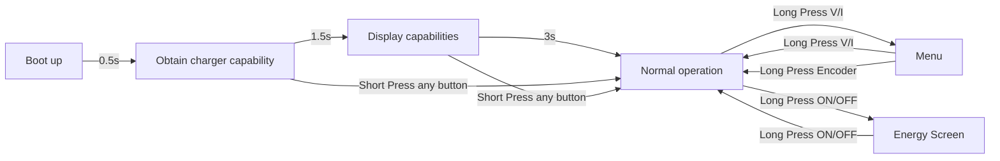
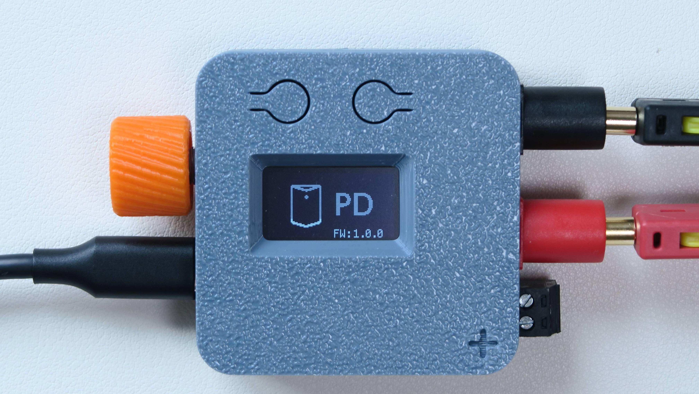
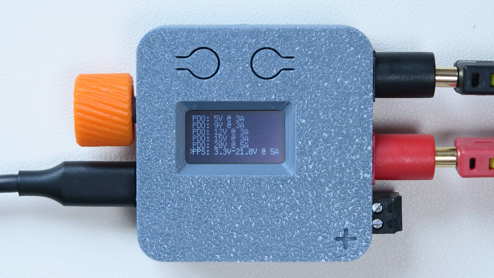
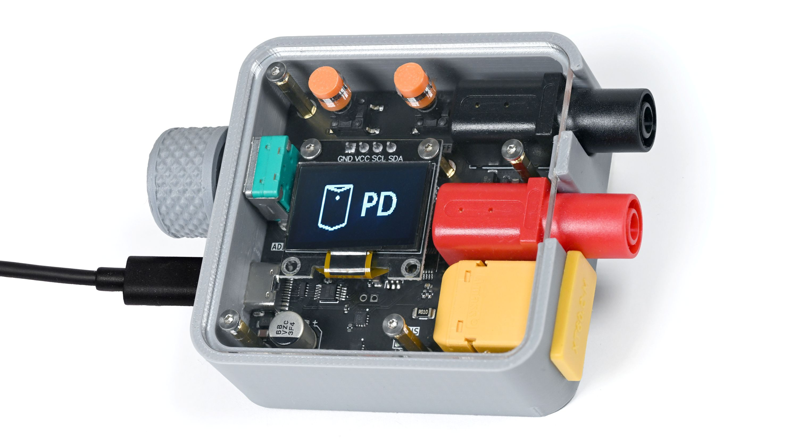

[](https://github.com/braamBeresford/PocketPD/actions/workflows/main.yml)
## Description

PocketPD is a portable USB-C bench power supply that can fit in your pocket. Combine with a USB-C PD 3.0/3.1 power source and you can ultilize the PPS profile to create a portable power supply with voltage and current adjustment.

As the DIY community has grown, there are multiple ways to implement control features like adjusting parameters via Wifi, Bluetooth, or touch screen. We want to keep the design language simple, just physical knobs and buttons to control. This will give the system higher reliability when you need it to work.

## Links

* [PocketPD Project - Hackaday](https://hackaday.io/project/194295-pocketpd-usb-c-portable-bench-power-supply)
* [PocketPD Hardware - GitHub](https://github.com/CentyLab/PocketPD_HW)

## System flow chart



## Operational manual

### Boot up sequence

System will display the flashed firmware version.

<p align="center" width="100%">
    
</p>

The system will then display the available profile from the charger. Please note that **PPS profile is needed** for PocketPD to fully function as a bench power supply. If your charger doesn't support pps, you will get a profile like [this](#profile-example-for-non-pps-charger)

<p align="center" width="100%">
    
</p>
After 3 seconds, the system will enter operating mode. If PPS mode exist, the system will request 5V @ 1A

<p align="center" width="100%">
    
</p>

If the bootup profile is not what you want, hold the Volt/Amp button (left button) for 3 secconds to enter MENU screen and select your desire profile.


### Skip boot screen

When the device is at boot screen:

+ Press any BUTTON, to skip to NORMAL state (operational screen)
+ Rotate ENCODER, to skip to MENU state (select power profile)
+ Turning the encoder to select profile
+ Long press encoder to activate profile

<p align="center" width="100%">
<video src="https://github.com/user-attachments/assets/563d36e5-1c92-49e6-aa88-c873a20ddf1d" width="80%" controls></video>
</p>

### Normal operation

+ Turning the encoder to increase/decrease voltage/current
+ Short press encoder to change increment from fine to coarse
+ Short press Volt/Amp button to switch between adjusting Voltage or Current
+ Long press Volt/Amp button to enter MENU screen
+ Short press On/Off button to enable output
+ Long press On/Off button to enter ENERGY screen

<p align="center" width="100%">
<video src="https://github.com/user-attachments/assets/1aa5be08-7ff9-443c-b3c7-ea3d54f766d1" width="80%" controls></video>
</p>

<p align="center" width="100%">
<video src="https://github.com/user-attachments/assets/d8f55b10-d94f-4dc2-9a7f-f5e726f47ec9" width="80%" controls></video>
</p>

<p align="center" width="100%">
<video src="https://github.com/user-attachments/assets/7a1174bd-7ffe-4ea3-8e91-18dc4e83c6fd" width="80%" controls></video>
</p>

### Menu page
<p align="center" width="100%">
    
</p>

### Energy page
<p align="center" width="100%">
    
</p>

### Example fixed 15V @ 3A profile

<p align="center" width="100%">
    
</p>
<br>

### Profile example for non PPS charger

If your charger doesn't support PPS profile, PocketPD will directly boot into the first 5V PDO profile. Your menu will looks like this:

<p align="center" width="100%">
    
</p>

## Compile the code

+ You will need [VSCode](https://code.visualstudio.com/download) with [Platform IO extension](https://docs.platformio.org/en/latest/integration/ide/vscode.html#installation).
+ Before letting Platform IO pulling the pico-sdk files. Follow [Important steps for Windows users, before installing](https://arduino-pico.readthedocs.io/en/latest/platformio.html#important-steps-for-windows-users-before-installing)
  Else you will encounter:

```
VCSBaseException: VCS: Could not process command ['git', 'clone', '--recursive', 'https://github.com/earlephilhower/arduino-pico.git', 'C:\\Users\\keylo\\.platformio\\.cache\\tmp\\pkg-installing-iypaogfn']
```

+ Go to PlatformIO extension -> Pico -> General -> Build
+ Output of the build process will be in .pio/build/pico/

## Firmware compability


| Firmware Version | Hardware 1.0 <br> (Limited) | Hardware 1.1 | Hardware 1.2 | Hardware 1.3 <br> (CrowdSupply) |
| ------------------ | ------------------------ | -------------- | -------------- | ---------------------------- |
| `Release 0.8.0`  | x                      |              |              |                            |
| `Release 0.9.0`  | x                      |              |              |                            |
| `Release 0.9.5`  | x                      |              |              |                            |
| `Release 0.9.7`  | x                      | x            | x            | x                          |
| `Release 0.9.9`  | x                      | x            | x            | x                          |
| `Release 1.0.0`  | x                      | x            | x            | x                          |

The main different in HW1.0 and later version is the change in sense resistor, from 10mOhm to 5mOhm. Thus change the current reading scale. Changes from HW1.0+ are mainly connector and component rearrangement.

This is what our "Limited" version HW1.0 looks like. We had to move away from this design due to the difficulty for mass production.

<p align="center" width="100%">
    
</p>


## How to flash new firmware

Note: Firmware at and before `0.9.5` is only for `PocketPD HW1.0`

Step 1: Select the correct hardware version from [PocketPD's Firmware Releases](https://github.com/CentyLab/PocketPD/releases)

+ HW1.0: Also known as "Limited edition". Download `firmware_xx_HW1.0.uf2`
+ HW1.1+: Our standard production version. Download `firmware_xx_HW1.1.uf2`

Step 2: Mount PocketPD as a drive in your computer

For MacBook user:

+ Method 1: (Easy)
  + Short the BOOT pads at the back of the device with a tweezer in `HW1.0` or hold the BOOT button in `HW1.1`.
  + Use a USB-A -> USB-C adapter, then use a USB-A -> USB-C cable to connect PocketPD to computer. PocketPD should pop up as `RPI_RP2` drive.
+ Method 2: (Intermediate)
  + Use a USB-A -> USB-C adapter, then use a USB-A -> USB-C cable to connect PocketPD to computer. No drive will popup.
  + Use any serial monitor, and start a Serial port with 1200 Baudrate. PocketPD should pop up as `RPI_RP2` drive.

For Windows user:

+ Method 1: (Easy)
  + Short the BOOT pads at the back of the device with a tweezer in `HW1.0` or hold the BOOT button in `HW1.1`.
  + Use any USB cable to connect PocketPD to computer. PocketPD should pop up as `RPI_RP2` drive.
+ Method 2: (Intermediate)
  + Use any USB cable to connect PocketPD to computer. No drive will pop-up.
  + Open [Putty](https://www.putty.org/) and open a Serial port with 1200 Baudrate. PocketPD should pop up as `RPI_RP2` drive.

Step 3: Drag and drop the `.uf2` file into the drive

If you build the firmware directly from VSCode, the `.uf2` file will be in `.pio/build/pico/`

Detail guide [How to upload new firmware to PocketPD](https://github.com/CentyLab/PocketPD/wiki/How-to-upload-new-firmware-to-PocketPD)

## Acknowledgement
We would like to thank many of our user for submitting feature request and test feedback over the year. Special thanks to our firmware contributors for making this project better every single commit!
