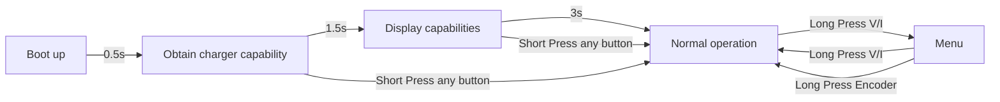

## Description
PocketPD is a portable USB-C bench power supply that can fit in your pocket. Combine with a USB-C PD 3.0/3.1 power source and you can ultilize the PPS profile to create a portable power supply with voltage and current adjustment.

As the DIY community has grown, there are multiple ways to implement control features like adjusting parameters via Wifi, Bluetooth, or touch screen. We want to keep the design language simple, just physical knobs and buttons to control. This will give the system higher reliability when you need it to work.

## Links
* [PocketPD Project - Hackaday](https://hackaday.io/project/194295-pocketpd-usb-c-portable-bench-power-supply)
* [PocketPD Hardware - GitHub](https://github.com/CentyLab/PocketPD_HW)

## System flow chart



## Operational manual
### 1. Boot up sequence
If your charger support PPS (Programable Power Supply) mode, the charger will first enter BOOT screen.

<p align="center" width="100%">
    
</p>

The system will then display the available profile from the charger.

<p align="center" width="100%">
    
</p>
After 3 seconds, the system will enter operating mode. If PPS mode exist, the system will request 5V @ 1A

<p align="center" width="100%">
    
</p>

### 2. Skip boot screen
When the device is at boot screen:
+ Press any BUTTON, to skip to NORMAL state (operational screen)
+ Rotate ENCODER, to skip to MENU state (select power profile)

### 3. In NORMAL state:
+ Turning the encoder to increase/decrease voltage/current
+ Short press encoder to change increment from fine to coarse
+ Short press Volt/Amp button to switch between adjusting Voltage or Current
+ Short press On/Off button to enable output
+ Long press Volt/Amp button to enter MENU

### 4. In MENU state:
+ Turning the encoder to select profile
+ Long press encoder to activate profile
+ Long press Volt/Amp button to return to normal operation and cancel profile change

<p align="center" width="100%">
    
</p>

Example when select 5V @ 3A profile 

<p align="center" width="100%">
    
</p>
<br>

### 5. Profile example for non PPS charger
If your charger doesn't support PPS profile, PocketPD will directly boot into the first 5V PDO profile. Your menu will looks like this:

<p align="center" width="100%">
    
</p>


## Compile the code
+ You will need [VSCode](https://code.visualstudio.com/download) with [Platform IO extension](https://docs.platformio.org/en/latest/integration/ide/vscode.html#installation).

+ Before letting Platform IO pulling the pico-sdk files. Follow [Important steps for Windows users, before installing](https://arduino-pico.readthedocs.io/en/latest/platformio.html#important-steps-for-windows-users-before-installing)
Else you will encounter:

```
VCSBaseException: VCS: Could not process command ['git', 'clone', '--recursive', 'https://github.com/earlephilhower/arduino-pico.git', 'C:\\Users\\keylo\\.platformio\\.cache\\tmp\\pkg-installing-iypaogfn']
```

+ Go to PlatformIO extension -> Pico -> General -> Build

+ Output of the build process will be in .pio/build/pico/


## How to flash new firmware
Note: Firmware at and before `0.9.5` is only for `PocketPD HW1.0`

Step 1: Select the correct hardware version from [PocketPD's Firmware Releases](https://github.com/CentyLab/PocketPD/releases)

+ HW1.0: Also known as "Limited edition". Download `firmware_xx_HW1.0.uf2`
+ HW1.1: Our standard production version. Download `firmware_xx_HW1.1.uf2`

Step 2: Mount PocketPD as a drive in your computer

For MacBook user:
+ Method 1: (Easy)
    + Short the BOOT pads at the back of the device with a tweezer in `HW1.0` or hold the BOOT button in `HW1.1`.
    + Use a USB-A -> USB-C adapter, then use a USB-A -> USB-C cable to connect PocketPD to computer. PocketPD should pop up as `RPI_RP2` drive.
+ Method 2: (Intermediate)
    + Use a USB-A -> USB-C adapter, then use a USB-A -> USB-C cable to connect PocketPD to computer. No drive will popup.
    + Use any serial monitor, and start a Serial port with 1200 Baudrate. PocketPD should pop up as `RPI_RP2` drive.

For Windows user: 
+ Method 1: (Easy)
    + Short the BOOT pads at the back of the device with a tweezer in `HW1.0` or hold the BOOT button in `HW1.1`.
    + Use any USB cable to connect PocketPD to computer. PocketPD should pop up as `RPI_RP2` drive.
+ Method 2: (Intermediate)
    + Use any USB cable to connect PocketPD to computer. No drive will pop-up.
    + Open [Putty](https://www.putty.org/) and open a Serial port with 1200 Baudrate. PocketPD should pop up as `RPI_RP2` drive.

Step 3: Drag and drop the `.uf2` file into the drive


If you build the firmware directly from VSCode, the `.uf2` file will be in `.pio/build/pico/`

Detail guide [How to upload new firmware to PocketPD](https://github.com/CentyLab/PocketPD/wiki/How-to-upload-new-firmware-to-PocketPD)
