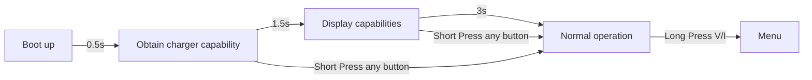

## Description
PocketPD is a portable USB-C bench power supply that can fit in your pocket. Combine with a USB-C PD 3.0/3.1 power source and you can ultilize the PPS profile to create a portable power supply with voltage and current adjustment.

As the DIY community has grown, there are multiple ways to implement control features like adjusting parameters via Wifi, Bluetooth, or touch screen. We want to keep the design language simple, just physical knobs and buttons to control. This will give the system higher reliability when you need it to work.

## System flow chart




## Compile the code
+ You will need VSCode with Platform IO extension.

+ Before letting Platform IO pulling the pico-sdk files. Follow [Important steps for Windows users, before installing](https://arduino-pico.readthedocs.io/en/latest/platformio.html#important-steps-for-windows-users-before-installing)
Else you will encounter:

```
VCSBaseException: VCS: Could not process command ['git', 'clone', '--recursive', 'https://github.com/earlephilhower/arduino-pico.git', 'C:\\Users\\keylo\\.platformio\\.cache\\tmp\\pkg-installing-iypaogfn']
```

+ Go to PlatformIO extension -> Pico -> General -> Build

+ Output of the build process will be in .pio/build/pico/