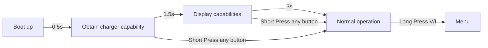
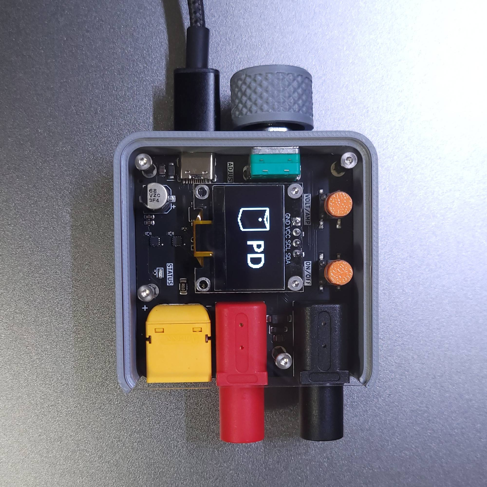
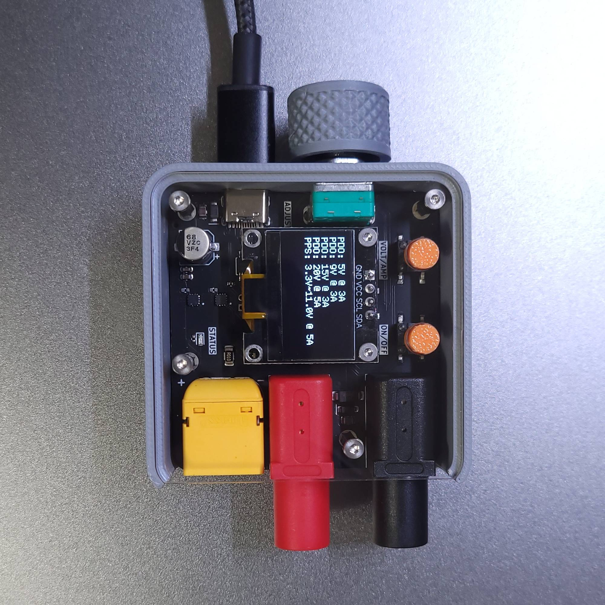
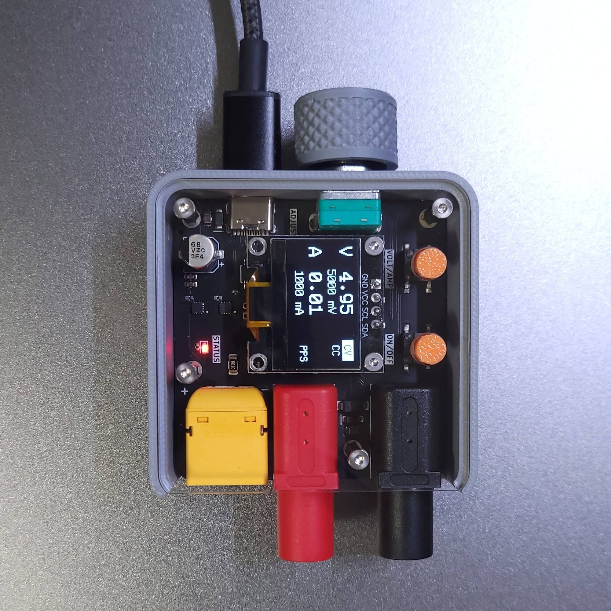
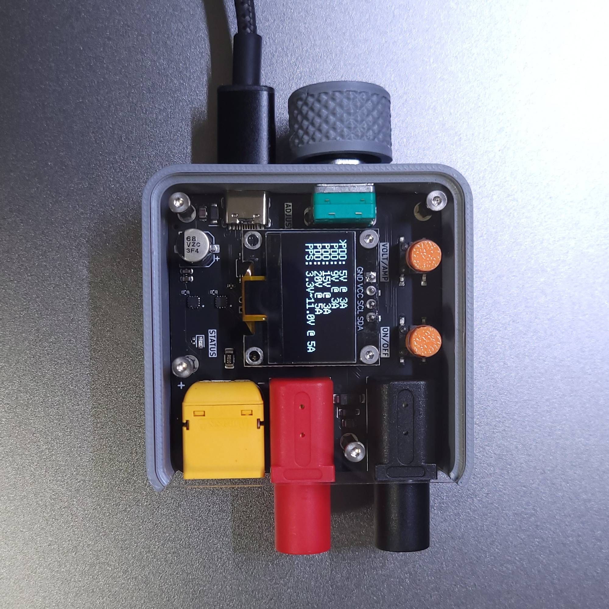

## Description
PocketPD is a portable USB-C bench power supply that can fit in your pocket. Combine with a USB-C PD 3.0/3.1 power source and you can ultilize the PPS profile to create a portable power supply with voltage and current adjustment.

As the DIY community has grown, there are multiple ways to implement control features like adjusting parameters via Wifi, Bluetooth, or touch screen. We want to keep the design language simple, just physical knobs and buttons to control. This will give the system higher reliability when you need it to work.

## System flow chart



## Operational manual
If your charger support PPS (Programable Power Supply) mode, the charger will first enter BOOT screen.

<p align="center" width="100%">
    
</p>

The system will then display the available profile from the charger.

<p align="center" width="100%">
    
</p>
After 3 seconds, the system will enter operating mode. If PPS mode exist, the system will request 5V @ 1A

<p align="center" width="100%">
    
</p>


In NORMAL state:
+ Turning the encoder to increase/decrease voltage/current
+ Short press encoder to change increment from fine to corse
+ Short press Volt/Amp button to switch between adjusting Voltage or Current
+ Short press On/Off button to enable output
+ Long press Volt/Amp to enter MENU

In MENU state:
+ Turning the encoder to select profile
+ Long press encoder to activate profile
+ Long press Volt/Amp to return to normal operation and cancel profile change

<p align="center" width="100%">
    
</p>

Example when select 5V @ 3A profile 

<p align="center" width="100%">
    
</p>
<br>

**Note**: If your charger doesn't support PPS profile, PocketPD will directly boot into the first 5V PDO profile. Your menu will looks like this:

<p align="center" width="100%">
    
</p>


## Compile the code
+ You will need [VSCode](https://code.visualstudio.com/download) with [Platform IO extension](https://docs.platformio.org/en/latest/integration/ide/vscode.html#installation).

+ Before letting Platform IO pulling the pico-sdk files. Follow [Important steps for Windows users, before installing](https://arduino-pico.readthedocs.io/en/latest/platformio.html#important-steps-for-windows-users-before-installing)
Else you will encounter:

```
VCSBaseException: VCS: Could not process command ['git', 'clone', '--recursive', 'https://github.com/earlephilhower/arduino-pico.git', 'C:\\Users\\keylo\\.platformio\\.cache\\tmp\\pkg-installing-iypaogfn']
```

+ Go to PlatformIO extension -> Pico -> General -> Build

+ Output of the build process will be in .pio/build/pico/

## How to flash new firmware
You can mount the PocketPD as a removable drive by:
+ Plug the device into your PC. Open Putty and open a Serial port with 1200 Baudrate.
+ Short the BOOT pads at the back of the device with a tweezer, then plug the USB into your PC.

Then you drag and drop the firmware.uf2 from .pio/build/pico/ in to the drive

Detail guide [How to upload new firmware to PocketPD](https://github.com/CentyLab/PocketPD/wiki/How-to-upload-new-firmware-to-PocketPD)